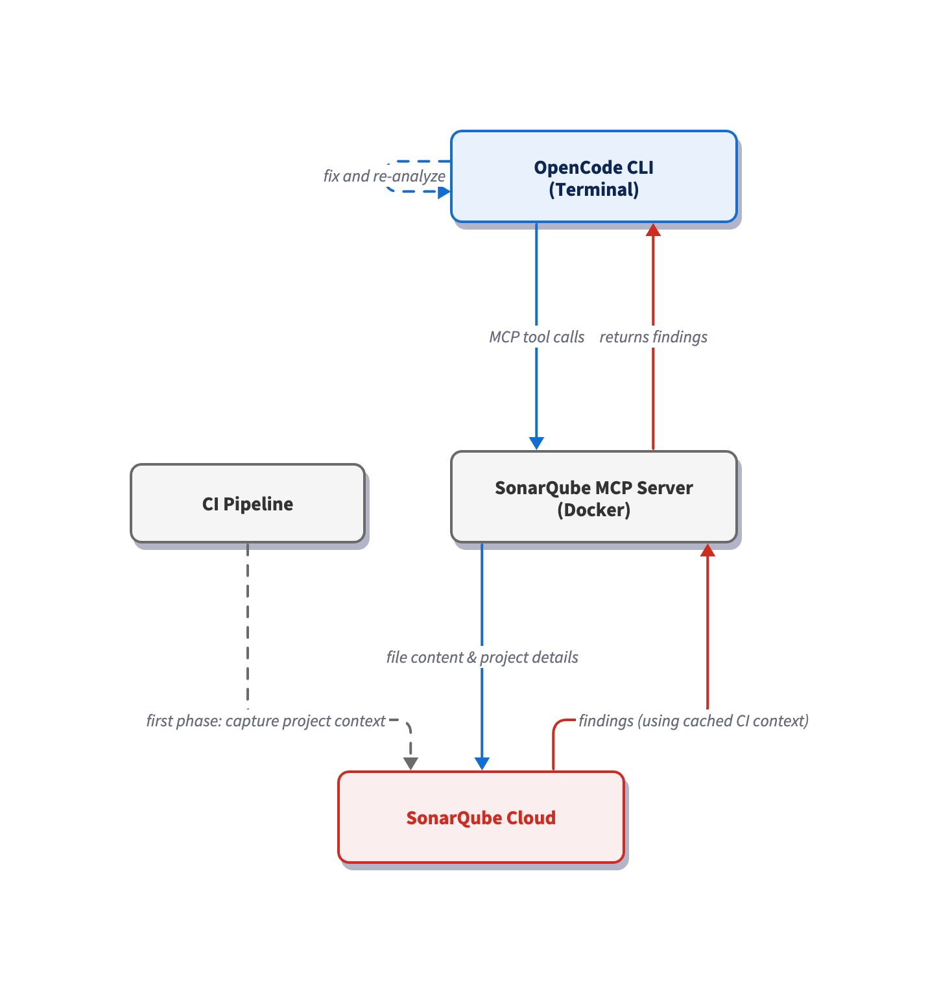

# Configure OpenCode CLI for Sonar Context Augmentation and Agentic Analysis

> Last verified: May 2026

## TL;DR overview

* Connecting OpenCode CLI to SonarQube Cloud brings Sonar Context Augmentation and SonarQube Agentic Analysis into the agent loop through a single `opencode.json` configuration.  
* Context Augmentation anchors the Guide phase, keeping agent-generated code aligned with your standards by feeding OpenCode CLI architecture context and project-specific coding guidelines.  
* Agentic Analysis powers the Verify phase, running advanced code analysis on the agent's output to surface vulnerabilities, bugs, and code smells with static analysis.  
* Agent directives orchestrate both phases, while the SonarQube MCP Server connects OpenCode CLI to SonarQube Cloud.

[AI coding agents](https://www.sonarsource.com/resources/library/what-is-an-ai-agent/) are effective at producing large quantities of code, but the quality of that code doesn't scale. Software developers must guide their coding agents with adequate context and analyze the code that they produce to ensure that code quality keeps pace with code quantity. Integrating [OpenCode CLI](https://opencode.ai/docs) with [SonarQube Cloud](https://www.sonarsource.com/products/sonarqube/cloud/) pulls [Sonar Context Augmentation](https://docs.sonarsource.com/agent-centric-development-cycle/features/context-augmentation) and [SonarQube Agentic Analysis](https://docs.sonarsource.com/agent-centric-development-cycle/features/agentic-analysis) into the agent loop through a single `opencode.json` configuration. Context Augmentation steers the *Guide* phase, ensuring that agent-generated code adheres to your standards by providing OpenCode CLI with architecture context and project-specific coding guidelines. Agentic Analysis drives the *Verify* phase, running advanced code analysis on the agent-generated code to identify [vulnerabilities](https://www.sonarsource.com/resources/library/vulnerability-management/), [bugs](https://www.sonarsource.com/resources/library/software-bugs/), and [code smells](https://www.sonarsource.com/resources/library/code-smells/) with rule-based reasoning. Agent directives govern both phases, while the [SonarQube MCP Server](https://docs.sonarsource.com/agent-centric-development-cycle/developer-tools/mcp-server/about-the-mcp-server) handles the connection between OpenCode CLI and SonarQube Cloud.

This blueprint details the configuration for OpenCode CLI, the open-source AI coding agent. The step-by-step workflow explores the Guide and Verify stages of the [Agent Centric Development Cycle](https://www.sonarsource.com/blog/the-future-is-ac-dc-the-agent-centric-development-cycle/) and uses [AWS’s CLI](https://github.com/aws/aws-cli) as the demo project. 

## When to use this

- You use OpenCode CLI to write code and want to guide the agent before code lands on disk.  
- You want to check agent-generated code for issues, fix those issues, and verify the fixes without leaving the terminal.

## What you'll achieve

- The SonarQube MCP Server registered in a project-scoped `opencode.json` file, with toolsets scoped to `cag,analysis,rules` and the workspace mounted at `/app/mcp-workspace`.  
- An `AGENTS.md` file at the project root that fires the Guide-phase tools before edits and the Verify-phase tools after.  
- A working triage flow wherein the agent surfaces every Sonar finding on changed files, calls `show_rule` to read the canonical guidance, and auto-fixes findings whose severity is `HIGH` or `BLOCKER`, or whose software quality is `SECURITY`.

## Architecture



The SonarQube MCP Server runs locally as a Docker container, with your workspace mounted at `/app/mcp-workspace`; it communicates with the CLI over stdio. When OpenCode CLI calls e.g. `run_advanced_code_analysis`, the MCP Server reads the modified file via the volume mount and sends its data to SonarQube Cloud, which restores the cached project context from your last CI scan and runs analysis with the precision of a full CI pipeline scan. The volume mount also maps your project into the container, enabling e.g. `get_current_architecture` to read your codebase structure without uploading any code.

## Prerequisites

- [**SonarQube Cloud**](https://www.sonarsource.com/products/sonarqube/cloud/) [**Team or Enterprise plan**](https://www.sonarsource.com/plans-and-pricing/sonarcloud/). You must enable both Agentic Analysis and Context Augmentation at the organization level (**Administration** \> **Agent-Centric Development**).  
- **A SonarQube Cloud project** with the demo project on board.  
- A completed CI scan (after you have enabled Agentic Analysis).  
- **Docker** up and running; the MCP server runs as a container.  
- A SonarQube Cloud **user token**. Create one under **My Account \> Security** on SonarQube Cloud. If Agentic Analysis was recently enabled, generate a fresh token as older tokens may not carry the required permissions.

**Demo project:** to follow this guide, first fork [`aws/aws-cli`](https://github.com/aws/aws-cli) to your GitHub account, import it into SonarQube Cloud with CI-based analysis enabled, and clone it locally. `aws-cli` is a large, pure-Python project that exercises both Guide and Verify phases at realistic scale.

## Step 1 — Register the SonarQube MCP Server

OpenCode reads MCP server registrations from `opencode.json`. In the root of your `aws-cli` clone, create the file and paste in the following configuration:

```
{
  "$schema": "https://opencode.ai/config.json",
  "mcp": {
    "sonarqube": {
      "type": "local",
      "command": [
        "docker", "run", "--init", "-i", "--rm", "--pull=always",
        "-e", "SONARQUBE_URL",
        "-e", "SONARQUBE_TOKEN",
        "-e", "SONARQUBE_ORG",
        "-e", "SONARQUBE_PROJECT_KEY",
        "-e", "SONARQUBE_TOOLSETS",
        "-v", "<ABSOLUTE_PATH_TO_AWS_CLI>:/app/mcp-workspace:rw",
        "mcp/sonarqube"
      ],
      "environment": {
        "SONARQUBE_URL": "https://sonarcloud.io",
        "SONARQUBE_ORG": "<YourOrganizationKey>",
        "SONARQUBE_PROJECT_KEY": "<YourProjectKey>",
        "SONARQUBE_TOOLSETS": "cag,analysis,rules"
      },
      "enabled": true,
      "timeout": 30000
    }
  }
}
```

Replace the three placeholder values:

- `<ABSOLUTE_PATH_TO_AWS_CLI>` — the full path to your project on disk (for example, `/Users/dev/aws-cli-demo`). Docker requires absolute paths; relative paths like `./` fail silently.  
- `<YourOrganizationKey>` — your SonarQube Cloud organization key.  
- `<YourProjectKey>` — your SonarQube Cloud project key, found on the **Project Information** page in SonarQube Cloud or in `sonar-project.properties`.

`SONARQUBE_TOKEN` is deliberately absent from the `environment` block and should be exported as a shell variable (covered in Step 3). Docker passes it to the container via the `-e SONARQUBE_TOKEN` flag in the `command` array. As a result (and to avoid possibly committing the token) it never lands in `opencode.json`.

The `SONARQUBE_TOOLSETS` value `cag,projects,analysis,rules` combines both the Guide and Verify capabilities for an all-in-one configuration. `cag` raises tools including `get_guidelines` and `get_current_architecture`, and `analysis` raises the `run_advanced_code_analysis` tool. `rules` enables `show_rule` which is utilized by the Verify directives that we will define in the next step.

## Step 2 — Author Guide & Verify directives

To guide the agent and verify its output, create `AGENTS.md` in the project root and paste in the following directives:

```
# SonarQube Agentic Workflow — Usage Directive (MUST FOLLOW)

## GUIDE Phase — Before Generating Code
1. Call `get_guidelines` for project context and coding standards.
2. Locate existing code with `search_by_signature_patterns` or
   `search_by_body_patterns`. Do this before exploring files directly —
   they will speed up the process.
3. Read implementation with `get_source_code`.

When changing architecture or dependencies:
- Check `get_current_architecture` and `get_intended_architecture`.
- Analyze impact using:
  - `get_upstream_call_flow` / `get_downstream_call_flow` — trace method calls.
  - `get_references` — find all usages.
  - `get_type_hierarchy` — check inheritance.

## VERIFY Phase — After Generating Code
1. Read Phase: Load current state of relevant source files.
2. Analysis Phase: Call `run_advanced_code_analysis` with:
   - filePath: Project-relative path.
   - branchName: Active development branch.
   - `fileScope`: `MAIN` or `TEST` depending on the code type.
3. Evaluation & Remediation:
   - Call `show_rule` for every issue.
   - Mandatory fix any issue with `impacts[].severity` of HIGH or BLOCKER,
     or any issue with `impacts[].softwareQuality` of SECURITY.
4. Verification: Re-run analysis after fixes to confirm resolution and
   no regressions.
```

OpenCode reads agent rules from `AGENTS.md` at the project root. If you're already running Claude Code or Gemini against the same project, the `AGENTS.md` file takes precedence over (e.g.) `CLAUDE.md`. Note that the same `AGENTS.md` is consumed by other agents that adhere to this convention, so the directives function for different agents in the same project.

## Step 3 — Launch OpenCode CLI and confirm the MCP connection

Export your `SONARQUBE_TOKEN` in the shell and launch OpenCode:

```shell
export SONARQUBE_TOKEN="<your-personal-access-token>"
cd /path/to/your/aws-cli
opencode
```

To confirm the connection, type `/mcps` and toggle the MCPs until you see `sonarqube`.

Ensure that `sonarqube` is enabled, then prompt OpenCode for the available MCP tools.

With `SONARQUBE_TOOLSETS` set to `cag,analysis,rules`, you should see roughly 15 tools, including `search_my_sonarqube_projects`, `show_rule`, `get_guidelines`, `get_current_architecture`, `get_intended_architecture`, and `run_advanced_code_analysis`.

## Step 4 — Drive a guided edit

Now prompt the agent to implement new code in the cloned project. The details of the prompt are not especially important as `AGENTS.md` triggers the Guide directives prior to implementing the code. In our demo, we’ll target `awscli/customizations/utils.py` with a helper-extension task that needs to mirror existing conventions in the same module:

```
Add a new helper `deprecate_argument(argument_table, existing_name,
replacement_name)` to awscli/customizations/utils.py. It should mark
existing_name as a hidden alias for replacement_name so the old argument
keeps working, and emit a single deprecation warning the first time the
deprecated argument is used.
```

Thanks to the `AGENTS.md` directives, the agent invokes `get_guidelines` first, pulling project-based rules from the Sonar profile.
   
The agent then reads `utils.py` in full, walks `make_hidden_alias` and `_copy_argument` for signature and docstring conventions, and runs two `grep` follow-ups that confirm `warnings.warn` as the deprecation idiom and `add_to_params` as the wiring point. The helper lands at `awscli/customizations/utils.py:65`: every structural decision traces back to a project pattern.

## Step 5 — Investigate the project architecture

Architecture tools sit behind a conditional in the directive and only fire when the agent's task touches architecture or dependencies, which the one-file helper extension implemented in Step 4 doesn't satisfy. To put them on the agent's path, prompt for the architecture details directly:

```
What is the current architecture of this project?
```

The agent's call to `get_current_architecture` runs across each language ecosystem the server supports (`java`, `js`, `ts`, `py`, `cs`), and only the ecosystems your CI scan actually covered come back with data. The AWS CLI fork is pure Python, so the `awscli` package tree is returned: the root package wrapping `customizations`, `clidriver`, `formatter`, `argprocess`, and the per-service command modules underneath.

Treat this step as a wiring check; it proves that the architecture toolset is reachable from the agent's path. `get_current_architecture` pairs with `get_intended_architecture` for deviation detection on projects where an intended architecture has been defined.

## Step 6 — Verify the edits

Picking up from Step 4's guided edit, the agent calls `run_advanced_code_analysis` with the project-relative path, `branchName` set to the active development branch, and `fileScope` set to `MAIN`.

The call returns four findings: two on the new code and two on pre-existing code in `validate_mutually_exclusive`, an unrelated function that the change never touched. The agent reads each rule via `show_rule`, then applies the directive's severity gate: mandatory fix when `impacts[].severity` is `HIGH` or `BLOCKER`, or when `impacts[].softwareQuality` is `SECURITY`. Both new-code findings qualify, but for different reasons: one through the `SECURITY` software-quality path on a `MEDIUM`\-severity finding, the other through the `HIGH` severity path on a `MAINTAINABILITY` finding. Both gate paths fire in this single run.

The agent applies both fixes, dropping the suspicious module-level constant and removing the `try/except SystemExit` wrapper around `warnings.warn` before then re-running `run_advanced_code_analysis`. The re-scan confirms both new-code findings have cleared; only the two pre-existing LOW-severity findings in `validate_mutually_exclusive` remain, surfaced for human review and intentionally left untouched.

## How do I confirm the SonarQube Guide and Verify workflow is set up?

You should now have:

1. The [SonarQube MCP Server](https://www.sonarsource.com/products/sonarqube/mcp-server/) registered with OpenCode CLI: `opencode mcp list` shows `sonarqube` as `connected`, and an in-session tool list includes the Context Augmentation, Agentic Analysis, and rule tools.  
2. An `AGENTS.md` directive driving phase behavior: a real code-edit prompt fires `get_guidelines`, `search_by_*`, and `get_source_code` automatically before the agent writes anything.  
3. A working Guide and Verify flow: `run_advanced_code_analysis` surfaces findings on changed files, the agent reads each rule via `show_rule`, fixes those at or above the severity gate, and surfaces the rest with reasoning.

End-state: changes generated against the AWS CLI repository run through Sonar's project-specific Guide and Verify cycle inside the OpenCode CLI session, before they ever reach a reviewer.

## What to know about Sonar Context Augmentation & Agentic Analysis

- Context Augmentation and Agentic Analysis are in open beta; consult the [product release lifecycle](https://docs.sonarsource.com/sonarqube-cloud/appendices/product-release-lifecycle/) for more information.  
- Context Augmentation and Agentic Analysis are available in SonarQube Cloud currently, and not yet available in SonarQube Server.

## Next steps

- Reference the [SonarQube MCP Server docs](https://docs.sonarsource.com/agent-centric-development-cycle/developer-tools/mcp-server/about-the-mcp-server) for a complete breakdown of MCP tools.  
- Consult the Sonar [Context Augmentation](https://docs.sonarsource.com/agent-centric-development-cycle/features/context-augmentation) and [Agentic Analysis](https://docs.sonarsource.com/sonarqube-cloud/analyzing-source-code/agentic-analysis) documentation.  
- Dive into the [Agent Centric Development Cycle](https://www.sonarsource.com/blog/the-future-is-ac-dc-the-agent-centric-development-cycle/), the paradigm that frames our Guide, Verify, and Solve workflow.  
- Read [OpenCode MCP Servers documentation](https://opencode.ai/docs/mcp-servers/) and [OpenCode rules / AGENTS.md docs](https://opencode.ai/docs/rules/) to learn more about OpenCode's MCP integration and the rules-resolution model that gates it.